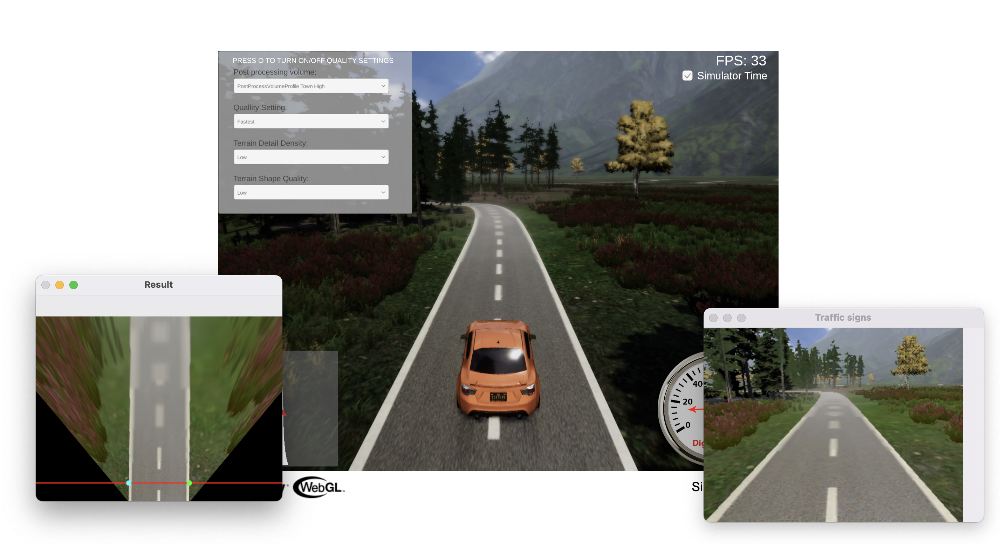

# Cuộc đua số 2023 - Thử thách: Thuật toán Tự hành

Trong thử thách này, các đội chơi sẽ phải lập trình thuật toán điều khiển xe tự hành bám làn và đi theo các biển báo giao thông có sẵn, gồm 5 biển: Rễ trái, Rẽ phải, Đi thẳng, Dừng và Cấm.

Các đội chơi thực hiện phát triển, tối ưu các thuật toán AI để điều khiển xe tự lái trong môi trường giả lập. Trong buổi thi đấu chính thức, mỗi đội sẽ có thời gian 1h để tối ưu thuật toán theo đề bài nhận được từ ban tổ chức.

- Mỗi đội có tối đa 3 lần gửi kết quả tới ban tổ chức để hệ thống tính điểm trong 1h thi đấu.
- Sau mỗi lần đội chơi nộp bài, thuật toán sẽ được sử dụng để điều khiển xe trên giả lập và trả về kết quả. Ban tổ chức sẽ có hệ thống tự động ranking kết quả của các đội
- **8 đội có kết quả mô phỏng tốt nhất sẽ bước tiếp vào vòng phỏng vấn.**

## 1. Thử nghiệm thuật toán với giả lập

### 1.1: Giả lập

Có 2 cách sử dụng giả lập:

- Truy cập giả lập dành cho thử nghiệm tại: [https://daisylab.net/via-sim-2023-07-23/](https://daisylab.net/via-sim-2023-07-23/).
- Truy cập và cài đặt giả lập trên máy tính cá nhân:
  - Windows: [Comming Soon](/);

### 1.2: Mã nguồn điều khiển xe mẫu:

Cài đặt và chạy code điều khiển mẫu với Python 3.9. Khuyến khích tạo và quản lý môi trường với **Anaconda** hoặc **Miniconda**.

```bash
cd auto_control
pip install -r requirements.txt
python drive.py
```

Mã nguồn điều khiển sẽ nhận hình ảnh từ giả lập và trả về tín hiệu điều khiển cho xe.



## 2. Tài liệu đào tạo

- Lập trình xe tự hành bám làn: <https://via.makerviet.org/vi/docs/autonomous-on-simulation/hello-via/>.
- Phát hiện biển báo giao thông: <https://via.makerviet.org/vi/docs/autonomous-on-simulation/traffic-sign-detection/>.

## 3. Đăng ký và nộp bài trên hệ thống

Thông tin này sẽ được cập nhật trong thời gian tới.
